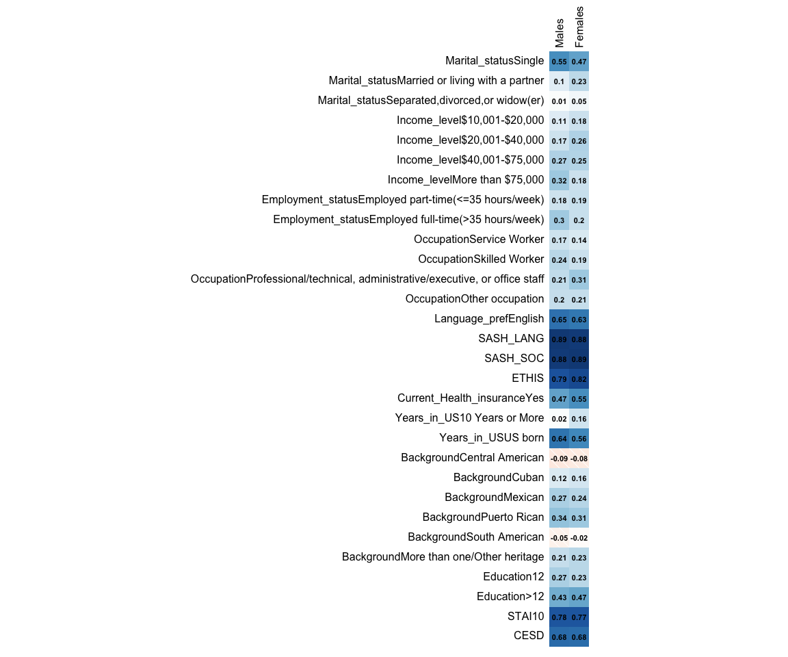

```r
library(corrplot)
```

```
## corrplot 0.92 loaded
```

# Read in the data


```r
dat <- as.matrix(read.csv("Heatmap_sample_data_1.csv", row.names = 1))
```


```r
corrplot(dat, 
         method = "shade", 
         addCoef.col = 'black', 
         tl.col = 'black', 
         cl.pos = 'n', 
         number.cex = 0.7)
```

<!-- -->


```r
sessionInfo()
```

```
## R version 4.2.3 (2023-03-15)
## Platform: aarch64-apple-darwin20 (64-bit)
## Running under: macOS Ventura 13.3.1
## 
## Matrix products: default
## BLAS:   /Library/Frameworks/R.framework/Versions/4.2-arm64/Resources/lib/libRblas.0.dylib
## LAPACK: /Library/Frameworks/R.framework/Versions/4.2-arm64/Resources/lib/libRlapack.dylib
## 
## locale:
## [1] en_US.UTF-8/en_US.UTF-8/en_US.UTF-8/C/en_US.UTF-8/en_US.UTF-8
## 
## attached base packages:
## [1] stats     graphics  grDevices utils     datasets  methods   base     
## 
## other attached packages:
## [1] corrplot_0.92
## 
## loaded via a namespace (and not attached):
##  [1] digest_0.6.31   R6_2.5.1        jsonlite_1.8.4  evaluate_0.21  
##  [5] highr_0.10      cachem_1.0.8    rlang_1.1.1     cli_3.6.1      
##  [9] rstudioapi_0.14 jquerylib_0.1.4 bslib_0.4.2     rmarkdown_2.21 
## [13] tools_4.2.3     xfun_0.39       yaml_2.3.7      fastmap_1.1.1  
## [17] compiler_4.2.3  htmltools_0.5.5 knitr_1.42      sass_0.4.6
```
